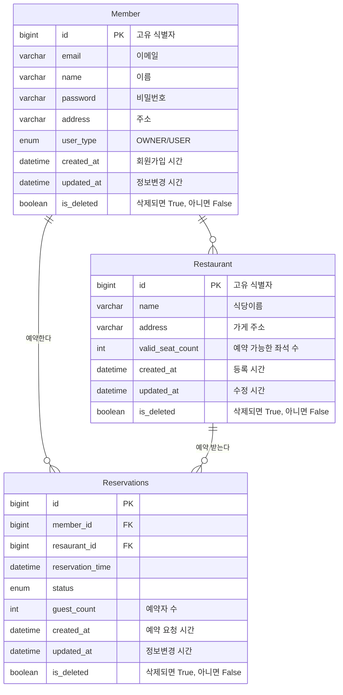

# EasyTable

## 🚀 프로젝트 소개 
 

<b>📅 프로젝트 기간: 2025/02/10 ~ 2025/03/17</b>

 

<b>📌 많은 사용자들의 동시 예약을 가정한 식당 예약 서비스</b>

## 🎯 Project Goals
 
<b>✅ 1. 예약이 1,000건 정도 몰리는 경우에도 응답속도가 안정적으로 나오도록 할 것</b> 
<b>🔍2. 메뉴 이름 및 지역별로 빠르고 정확한 식당 검색이 가능하도록 할 것 </b> 

## 🏗️ Infra Architecture 
 

### 🖥️ Monitoring Architecture

- **CloudWatch**
  

- **K6**
  

## 📊 ERD

## 📚 기술 스택 
 

☕ **Backend**
  

🗄 **Database & Caching**
  

📊 **Monitoring & Logging**
  

## ⚡ 주요 기능 
 

### 🍽️ 식당 예약 기능 

- 사용자가 식당 예약 요청 시 **동시성을 지키며** 식당의 남은 테이블 수를 관리할 수 있도록 구현
- **Redis Streams 기반 대기열**로 관리해 요청이 몰릴 경우에도 대처할 수 있도록 구현

### 🔍 식당 검색 기능
- 검색어, 분야 기반 **검색 기능의 속도 향상**을 위해 **ElasticSerach 도입**
- **MySQL과의 동기화**로 ElasticSearch의 다소 **부족한 쓰기 성능 보완**
- **ElasticSearch**를 통한 검색어의 **유사도 기반 검색** 구현

### 🔥 인기 식당 조회 기능 
- 예약이 많은 순서대로 식당을 조회한 결과를 **Redis에 캐싱**하도록 구현
- 캐시는 기본적으로 60분마다 초기화되도록 구현

## 기능 별 최종 성능
 

### 식당 예약
 
- **분산 lock의 한계점 및 분산/비관적 lock의  느린 Resp Time를 극복하기 위해 원자적 쿼리를 도입했고, 성공적으로 최적화 완료** 
    - 다만 비관적 lock이 추가적인 오버헤드가 없기에 근소하게 성능 측면에서 우위를 점하고 있다. 
- **대기열의 도입은 두 방식 모두 성능의 향상을 얻진 못했다.** 
    - 대기열의 경우 요청이 Redis/Kafka를 거쳐야 한다는 오버헤드를 감수하면서 Spring이 받아들일 수 있는 요청의 한계를 확장하기 위해 도입 
    - 그런 점을 고려했을 때 원자적 쿼리 방식과 거의 차이가 없는 Kafka가 매우 뛰어나다고 판단했다. 
    - 다만 비용 문제 등으로 인해 Redis Streams를 선택하게 되었다. 

### 식당 검색
 
- **전반적으로 검색 성능 측면에서 ElasticSearch 도입 이유가 명확하다고 생각한다.**

## 🛠️ Troubleshooting 

[1. Tocmat 및 DB 튜닝 결과](https://www.notion.so/teamsparta/Tomcat-DB-1b32dc3ef514809fadefd7f1a4e2c6a5?pvs=4) 
[2. grafana 데이터 비대화](https://www.notion.so/teamsparta/grafana-1b52dc3ef514801a8adcecf76f7239dc) 
[3. Nori 너! 한글 분석기라며! 근데 외글애?](https://www.notion.so/teamsparta/Nori-1b22dc3ef51480219eadd7f33e3b0ce9) 

## 팀원 소개 👨‍💻
 

| 🧑🏻‍💼 이름 | 💼 역할 | 🔗 Github                         |
|-------|-------|-----------------------------------|
| 황서호   | 팀장    | https://github.com/seoho1         |
| 김형준   | 부팀장   | https://github.com/mikejigglypuff |
| 문규민   | 팀원    | https://github.com/2020-byte      |
| 김학산   | 팀원    | https://github.com/KIMHAKSAN      |
| 김호진   | 팀원    | https://github.com/Hojin02        |

## 추가 개선점 및 아쉬운 점
 

- *Restaurant 별로 대기열 Stream을 나눠 관리되도록 구현하기(진행 중)* 
- 실제 서비스를 최소 베타 테스트처럼 운영하며 모니터링 및 스케일링 진행하면 좋을 것 같다. 
- 사용자 위치 기반 식당 검색 및 가게 조회도 구현되면 좋을 것 같다. 
- 현재 logstash로 수행되는 업데이트 외에도 추가적으로 테이블 full scan 후 ElasticSearch에 업데이트하도록 구현하면 좋을 것 같다.

